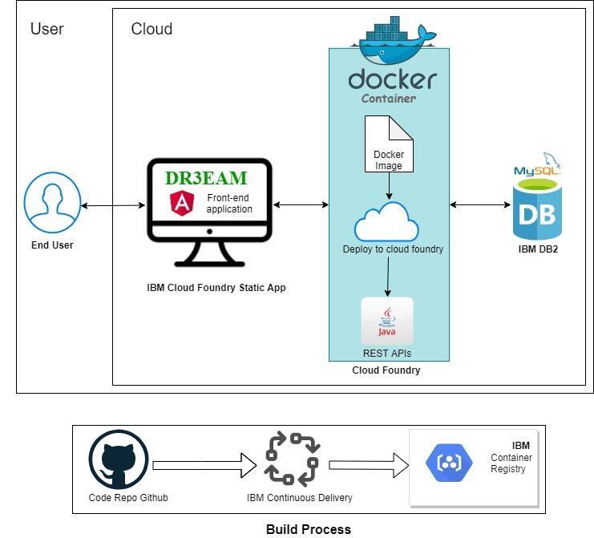
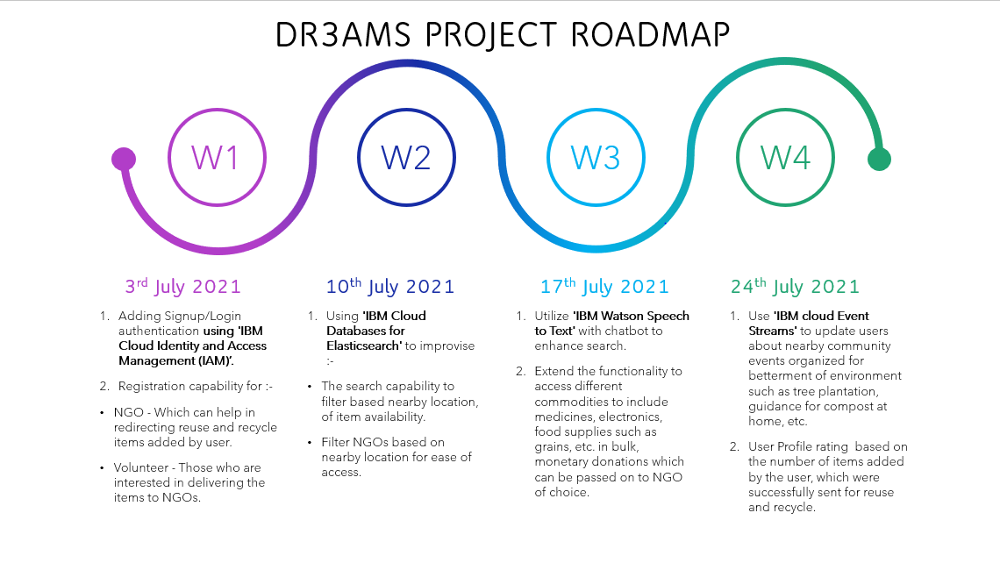
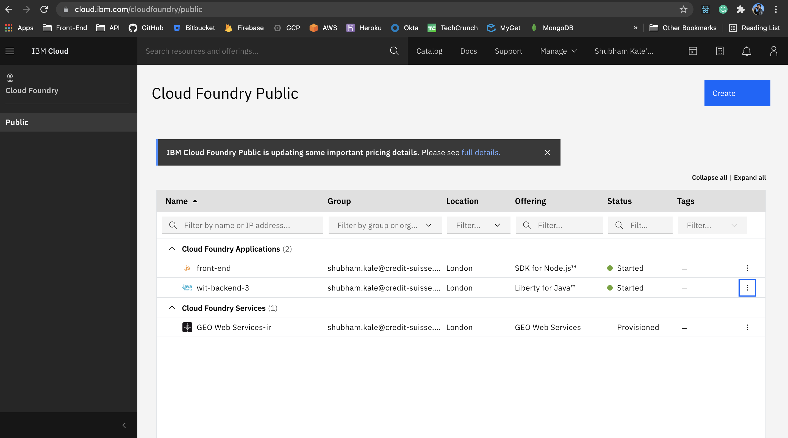
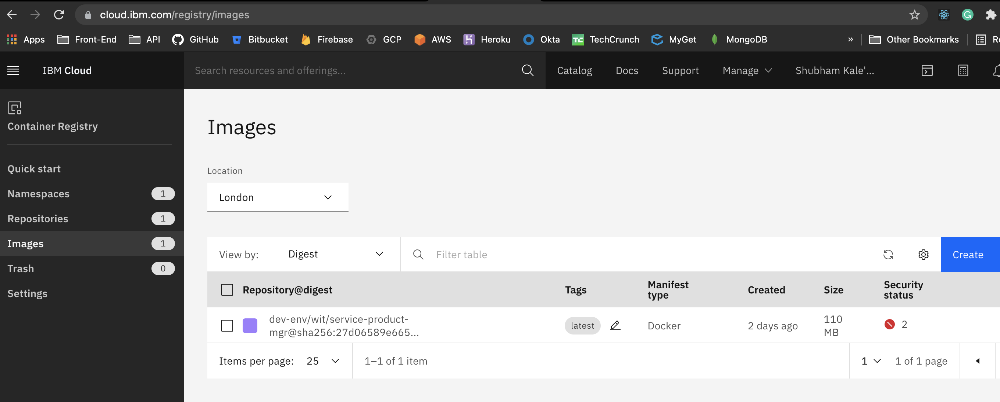
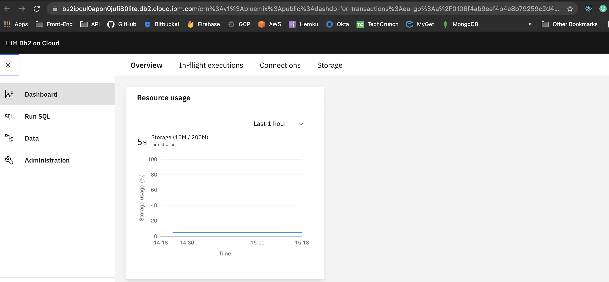
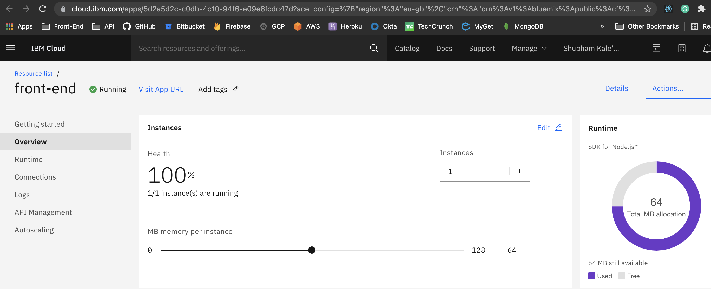
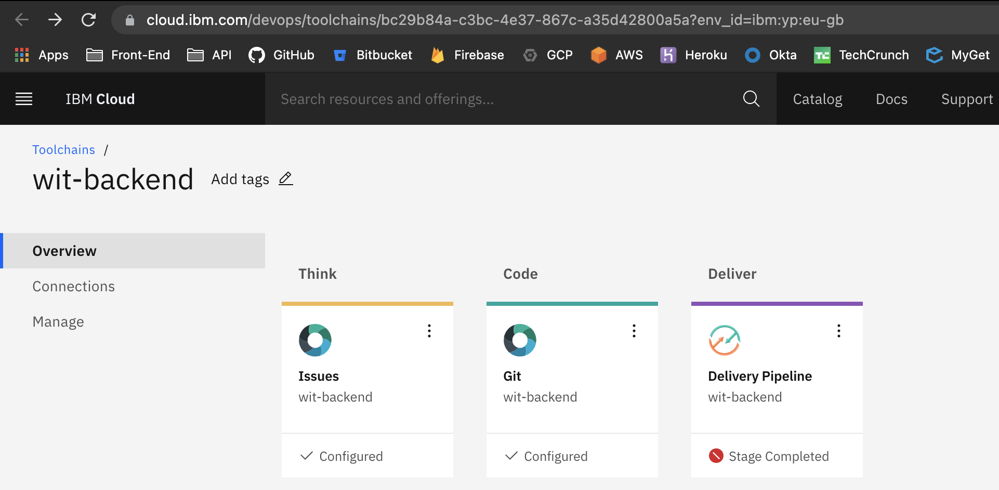

## Distributed Reduce Reuse Recycle and Management System

## Contents

- [Submission or project name](#submission-or-project-name)
  - [Contents](#contents)
  - [Short description](#short-description)
    - [What's the problem?](#whats-the-problem)
    - [How can technology help?](#how-can-technology-help)
    - [The idea](#the-idea)
  - [Demo video](#demo-video)
  - [The architecture](#the-architecture)
  - [Long description](#long-description)
  - [Project roadmap](#project-roadmap)
  - [Getting started](#getting-started)
  - [Live demo](#live-demo)
  - [Built with](#built-with)
  - [Authors](#authors)
  - [Acknowledgments](#acknowledgments)

## Short description

### What's the problem?

Each household contains unused medicines, electronic devices, clothes, etc. Most of the time it’s because they are past their shelf life, or it is because we no longer need them. Often it ends up in the dustbin and its journey ahead hampers the environment. The chemicals used in these products or parts of them, if placed in the right hand at the right time, might benefit someone who really needs it and thus be reused, or help in proper disposal by recycling them. Currently, there is no such way by which a person can actually help in getting these products at the right place, so that they are reused and recycled ahead, and thus benefiting the environment in the long run. 

### How can technology help?

With the technological advancement and widespread internet facilities around the world, having a one stop online portal where people can put across the details of the products which they want to be reused, or recycled, and help them reach the needy, will bridge the gap, which currently exists. 

### The idea

We are proposing ‘DR3AMS’- Distributed Reduce Reuse Recycle and Management System, an online portal helping users connect and contribute towards sustainability. This portal will have the capability where user can:- 
1. Create a new request for the item that they wish to provide for reuse/recycle.
2. Other users can go through the product list and connect with the user who has created the request.
3. NGOs can go through product catalogue and pick items that they help in getting recycled or reused ahead. 

## Demo video

https://www.youtube.com/watch?v=mSqvg5kvS3Y

## The architecture

## Long description

[More detail is available here](./docs/DESCRIPTION.md)

## Project roadmap

## Getting started

#### Development server for Front End
This project was generated with [Angular CLI](https://github.com/angular/angular-cli) version 12.0.4.

Run `ng serve` for a dev server. Navigate to `http://localhost:4200/`. The app will automatically reload if you change any of the source files.

#### Build

Run `ng build` to build the project. The build artifacts will be stored in the `dist/` directory. Use the `--prod` flag for a production build.

#### Deploy

Since we are using IBM cloud foundry CLI, below are the commands to deploy the app
`cf push`
#### Development server for Backend

checkout our another repo of Java APIs code: https://github.com/shubhamk54/wit-backend

#### Run using Spring boot plugin
`mvn spring-boot:run`
##### Run using Docker
`mvn clean install`

`docker build -t wit/service-product-mgr .`

`docker run -d -p 8080:8080 wit/service-product-mgr:latest`

##### Perform below steps to push the image to IBM CR

`mvn clean install`

`docker build -t uk.icr.io/dev-env/wit/service-product-mgr .`

`docker push uk.icr.io/dev-env/wit/service-product-mgr:latest`

##### deploy the app to cloud foundary
`cf push wit-backend-3 -o uk.icr.io/dev-env/wit/service-product-mgr:latest`

## Live demo

You can find a running system to test at [Live](https://front-end.eu-gb.cf.appdomain.cloud).

## Built with

- [IBM DB2](https://www.ibm.com/in-en/cloud/db2-on-cloud)- The relational SQL cloud database.
- [IBM Cloud Foundry](https://www.ibm.com/in-en/cloud/cloud-foundry) - PaaS environment, providing elastic consumption and serverless deployments
- [IBM Cloud Container Registry](https://www.ibm.com/in-en/cloud/container-registry) - To store docker images
- [IBM Cloud Cloud CLI](https://www.ibm.com/in-en/cloud/cli) - To interact with our applications, containers, infrastructures, and other services.

- [Maven](https://maven.apache.org/) - Dependency management
- [Angular 12](https://angular.io/docs/) - Developed user interfaces

## Authors
- [Snehal Ingle](https://github.com/inglesneh)
- [Purva Puranik](https://github.com/purvapuranik)
- [Apoorva Ambesange](https://github.com/ApoorvaAmbesange)
- [Gunjan Paliwal](https://github.com/gunjan7paliwal)
- [Shubham Kale](https://github.com/shubhamk54)

